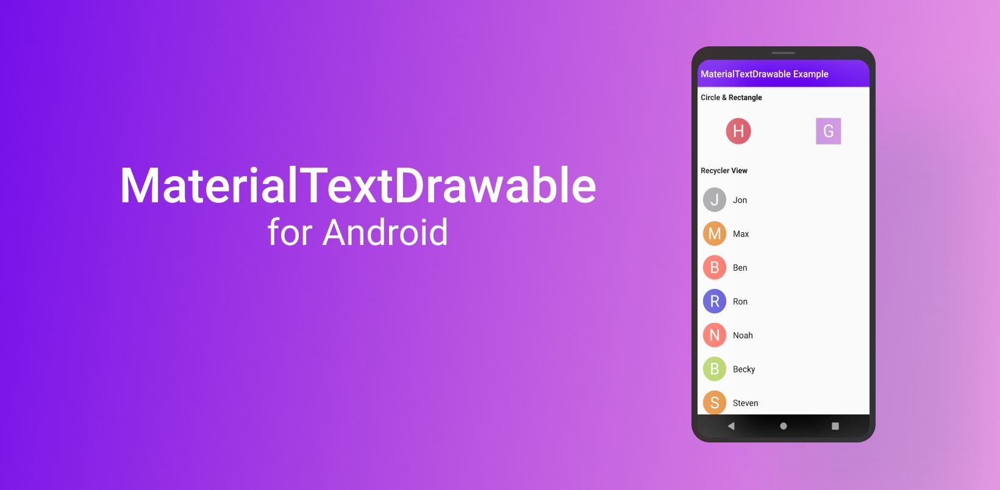

MaterialTextDrawable-for-android
==================================

This light-weight library provides drawable with letter/text just like the Gmail/Contacts app. It can be used with existing/custom/network `ImageView` classes. 

<p align="center">
    
</p>

## Compatibility
------------------
MaterialTextDrawable requires Android [Jellybean](https://developer.android.com/about/versions/jelly-bean) (API level 16) or higher.

## Quick usage
----------------
Simple use cases will look something like this:
```kotlin
    MaterialTextDrawable.with(context)
        .text("Hello")
        .into(imageView)
```

## Usage with other libraries
-------------------------------
You can use this library with any other image-loading library like Glide or Picasso in one easy step, first define an object of `MaterialTextDrawable` like this:

```kotlin
    val textDrawable = MaterialTextDrawable.with(context)
        .text("Hello")
        .get()
```
and then use this `textDrawable` object with the image-loading-library.

### Glide Example
-------------------
```kotlin
    Glide.with(context)
        .load("https://some_url")
        .placeholder(textDrawable)
        .into(imageView)
```

## Configuration
------------------
You can configure the `look/shape/size` of the text-drawable generated by MaterialTextDrawable using following configuration methods:

 * **with(context: Context)**: Used to create the `MaterialTextDrawable` instance by passing the `Activity` or `Fragment` context.

 * **text(text: String)**: This method is used to generate the initial character of the text-drawable, the text has to be passed using this method before calling the `get()` or `into()` methods else a `NullPointerException` will be thrown.

 * **textSize(size: Int)**: Define the height and width of the text-drawable, by default it uses a size of `150`. Example `textSize(200)` means `200x200`.

 * **shape(shape: MaterialShape)**: Define the shape of drawable using the `MaterialShape` enum, by default it uses `MaterialShape.CIRCLE` which returns a circular text-drawable.

 * **colorMode(mode: MaterialColorMode)**: Sets a random-color on drawable using the `MaterialColorMode` enum, by default it uses `MaterialColorMode.MEDIUM` for random-color.

 * **get()**: Returns a `BitmapDrawable` generated by the builder which can then be used to set the drawable on an `ImageView`.

 * **into(view: ImageView)**: Apply the text-drawable to an `ImageView` directly, no need to call `get()` when using this method. This method needs to be called on the `MainThread` else an `IllegalArgumentException` will be thrown.

 * **into(view: ImageView, scale: ImageView.ScaleType)**: Apply the text-drawable to an `ImageView` directly along with scaling option of the `ImageView` class, no need to call `get()` when using this method. This method needs to be called on the `MainThread` else an `IllegalArgumentException` will be thrown.

### Enums
---------
Following are the enums provided by the library:

  - MaterialShape
  ```
    CIRCLE
    RECTANGLE
  ```

  - MaterialColorMode
  ```
    LIGHT     // Material 900
    MEDIUM    // Material 700
    DARK      // Material 400
  ```

## Thanks
---------
 * AmosKorir for the [AvatarImageGenerator implementation](https://github.com/AmosKorir/AvatarImageGenerator) MaterialTextDrawable's drawable generation is based on.
 * Everyone who has contributed code or will contribute code and report/reported issues!

## License
----------
Apache 2.0. See the [LICENSE](https://github.com/adwardstark/materialtextdrawable-for-android/blob/master/LICENSE) file for details.